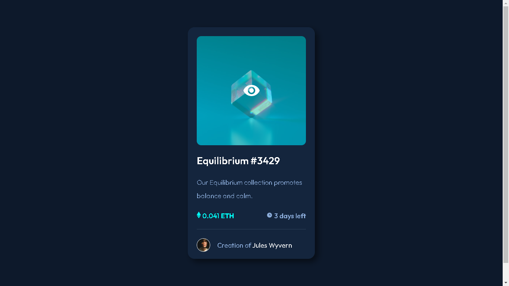
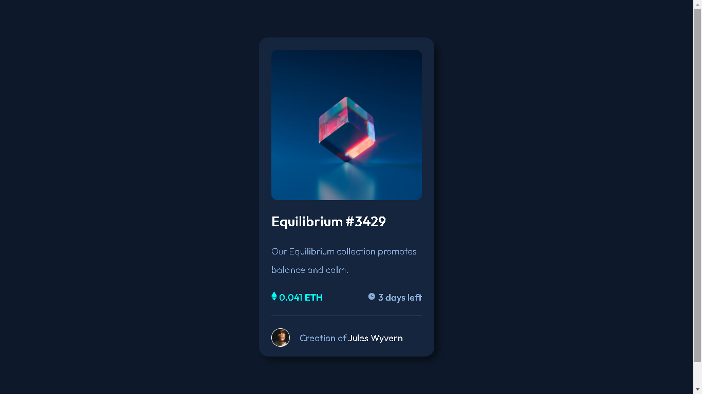

# Frontend Mentor - NFT preview card component solution

This is a solution to the [NFT preview card component challenge on Frontend Mentor](https://www.frontendmentor.io/challenges/nft-preview-card-component-SbdUL_w0U). Frontend Mentor challenges help you improve your coding skills by building realistic projects. 

## Table of contents

- [Overview](#overview)
  - [The challenge](#the-challenge)
  - [Screenshot](#screenshot)
  - [Links](#links)
- [My process](#my-process)
  - [Built with](#built-with)
  - [What I learned](#what-i-learned)
  - [Continued development](#continued-development)
  - [Useful resources](#useful-resources)
- [Author](#author)


## Overview

### The challenge

Users should be able to:

- Responsive design for different devices
- See hover states for interactive elements

### Screenshot




### Links

- Solution URL: [Add solution URL here](https://your-solution-url.com)
- Live Site URL: [Add live site URL here](https://nft-card-frontendmentor-challenge.netlify.app/)

## My process

### Built with

- Semantic HTML5 markup
- CSS custom properties
- Flexbox
- SCSS
- Mobile-first workflow

### What I learned

With this project I understood the use of SCSS and put it into practice.
Improve the use of CSS-Flex and the positioning of objects.

I read a bit about Z-Index and put it into practice applying it to hover.

```html
<h1>Some HTML code I'm proud of</h1>
```
```css
.proud-of-this-css {
  color: papayawhip;
}
```
```js
const proudOfThisFunc = () => {
  console.log('🎉')
}
```

### Continued development

I'm going to get better at using pseudoclasses and other design tools.
My next project will include JavaScript.

### Useful resources

- [Z-index idea](https://es.stackoverflow.com/questions/547758/aplicar-un-imagen-con-un-hover-en-css#comment969356_547768) - This helped me get the idea of ​​using Z-index
- [Video guide](https://www.example.com) - Video that I use as a guide to align the elements

## Author

- GitHub - [GitHub](https://github.com/AmilkarAlan)
- Netlify - [Netlify](https://app.netlify.com/teams/amilkaralan/overview)
- Frontend Mentor - [@AmilkarAlan](https://www.frontendmentor.io/profile/AmilkarAlan)
- Twitter - [@Amilkar_SanzMtz](https://twitter.com/Amilkar_SanzMtz)
